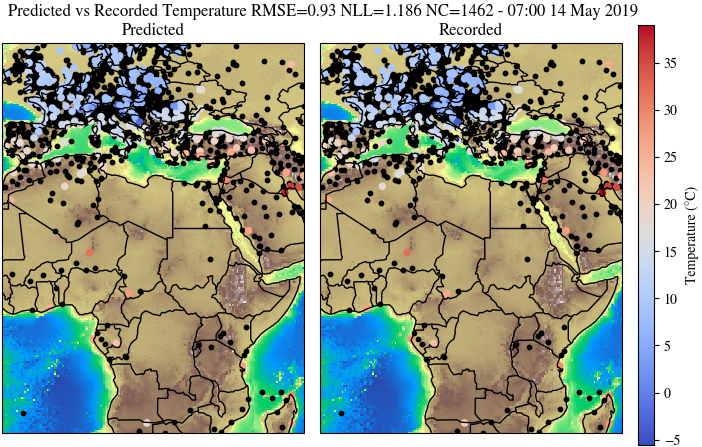

# Incremental Learning in Transformer Neural Processes
This repository contains the codebase used to develop my thesis on incremental transformer neural processes. This work builds on a general transformer neural process repository developed by Matthew Ashman and my co-supervisor Cristiana Diaconu which can be accessed [here](https://github.com/cambridge-mlg/tnp).




## Setting up the conda environment.
```bash
conda env create -f environment.yml
conda activate tnpp
pip install -e .
```
